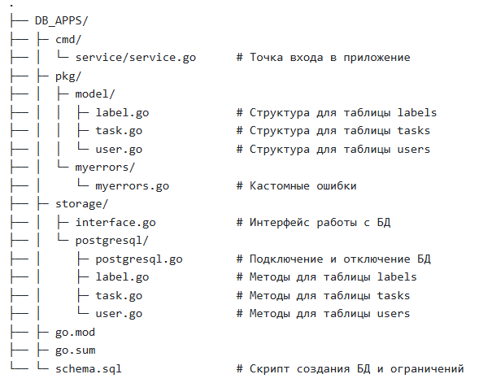
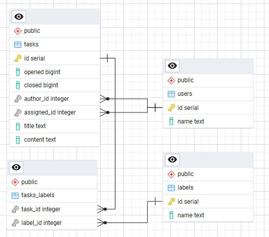

# DB_APPS
Учебный проект на **GO** для работы с задачами (таблица **tasks**), метками (таблица **labels**) и пользователями (таблица **users**) в **PostgreSQL**. Проект реализует CRUD операции с обработкой транзакций и кастомными ошибками.

## Цели проекта
- Практика работы соединения приложения на GO с PostgreSQL
- Реализация CRUD операций для задач, меток и пользователей
- Демонстрация работы с транзакциями и кастомными ошибками
- Реализация архектектуры  проекта с разделением логики на модели, хранилище, кастомные ошибки и сервис

## Структура проекта


## Схема БД


## Связи
- Users -> Tasks: Один ко многим
- Tasks -> Labels: Многие ко многим

Связь многи ко многим осуществляется через таблицу-связка tasks-labels
## Модели
**1. Задача (Task)**
```go
type Task struct {
	ID         int       // Уникальный идентификатор
    AuthorID   int       // ID автора задачи
    AssignedID int       // ID исполнителя задачи  
    Title      string    // Заголовок задачи
    Content    string    // Описание задачи
    Opened     time.Time // Дата создания
    Closed     time.Time // Дата завершения
    LabelsID   []int     // Список ID меток
}
```
**2. Пользователь (User)**
```go
type User struct {
    ID        int       // Уникальный идентификатор
    Name      string    // Имя пользователя
}
```
**2. Метка (Label)**
```go
type Label struct {
    ID    int    // Уникальный идентификатор
    Name  string // Название метки
}
```


## Основной функционал
### **Задачи (Tasks)**
**Создание задачи:**
- Метод: `NewTask(task Task) (int, error)`
- Описание: Создает новую задачу с привязкой меток
- Особенности:
  - Проверяет существование автора и исполнителя
  - Проверяет существование всех меток перед созданием
  - Использует транзакцию для атомарности
  - Возвращает кастомную ошибку `TaskPartialErr` при дабовлении меток, которая описывает из-за отсутствия каких меток прервалась вся транзакция

**Получение задач:**
- Метод: `SelectTasks() ([]Task, error)` - все задачи
- Метод: `SelectTasksByAuthorID(authorID int) ([]Task, error)` - по автору
- Метод: `SelectTasksByLabelID(labelID int) ([]Task, error)` - по метке

**Обновление задачи:**
- Метод: `UpdateTaskByID(task Task) error`
- Особенности:
  - Запрещает изменение автора задачи, если у него уже установле ID отличный от 0
  - Проверяет существование исполнителя
  - Обновляет связи с метками

**Удаление задачи:**
- Метод: `DeleteTask(id int) error`
- Особенности: Каскадное удаление связей с метками

### **Пользователи (Users)**
- `NewUser(user User) (int, error)` - создание пользователя
- `SelectUsers() ([]User, error)` - все пользователи
- `SelectUserByID(id int) (User, error)` - пользователь по ID
- `UpdateUser(user User) error` - обновление данных
- `DeleteUser(id int) error` - удаление пользователя

### **Метки (Labels)**
- `NewLabel(label Label) (int, error)` - создание метки
- `SelectLabels() ([]Label, error)` - все метки
- `SelectLabelByID(id int) (Label, error)` - метка по ID
- `UpdateLabel(label Label) error` - обновление метки
- `DeleteLabel(id int) error` - удаление метки

## Валидация данных
- Проверка внешних ключей (автор, исполнитель, метки)
- Очистка текстовых полей от пробелов
- Обработка ограничений базы данных
- Проверка имени пользователя и его форматирование

## Ключевые особенности
### Работа с транзакциями
- Все операции, затрагивающие несколько таблиц, выполняются в транзакции: 
```go
tx, err := s.db.Begin(ctx)
defer tx.Rollback(ctx)
// Выполнение операций
err = tx.Commit(ctx)
```
### Кастомные ошибки
- Ошибки вызванные при добавлении меток, формируются в одну общую ошибку и выводятся пользователю:
```go
type TaskPartialErr struct {
	TaskID int
	Errs   []error
}

func (e TaskPartialErr) Error() string {
	msgs := make([]string, len(e.Errs))
	for i, err := range e.Errs {
		msgs[i] = err.Error()
	}
	return fmt.Sprintf("\n\t- Ошибка: %s", strings.Join(msgs, "\n\t- Ошибка: "))
}
```